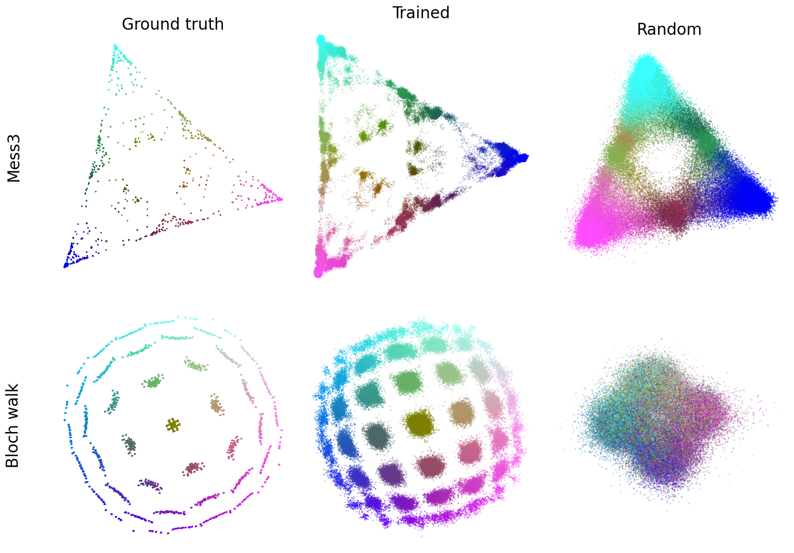
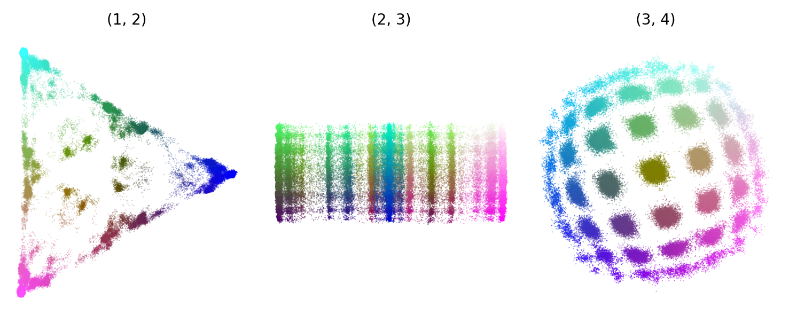

# Epsilon-Transformers (fork): two-process training and activation analysis






This fork focuses on two things:

- Training pipeline upgrades: simultaneous training on two processes (Mess3 and Bloch walk) in a single run.
- A working notebook for activation analysis and regression mapping from hidden states to belief states.

Below is a concise guide for setup, training, and analyzing results.

## Installation

1) Install the `uv` package manager (once):
```bash
pip install uv
```

2) Create and populate the virtual environment (step 0):
```bash
make create_env
```

## Training (Mess3 + Bloch walk together)

- This fork uses `configs/experiment_config_transformer_mess3_bloch_hw_6.yaml`, where the process is defined as a mixture of two data sources (Mess3 and Bloch/Bloch walk).
- The launcher dispatches jobs across available GPUs.

Start training:
```bash
make run_training
```

## Activation analysis

Notebook: `notebooks/Analysis.ipynb`.

Start Jupyter Lab:
```bash
make jupyter
```
Then open `notebooks/Analysis.ipynb` in your browser and select the Kernel you created via `uv`.

What the notebook does (brief):
- Prepares `.joblib` ground truth (combined Mess3 and Bloch) and sampling weights.
- Loads selected model checkpoints (typically "first and last").
- Runs regression "hidden states → belief states" on the last token.
- Produces visualizations (triangle/sphere and projections) to assess alignment quality.

Tips for notebook data:
- Inside the notebook, `RUN_DIR` points to the directory with models/metadata.

### Make commands

```bash
make create_env   # install dependencies via uv
make run_training # start training (Mess3 + Bloch)
make jupyter      # start Jupyter Lab (default port 8888, token: simplex)
```
